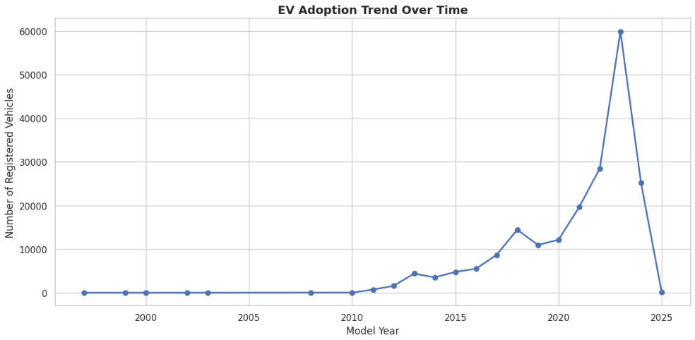
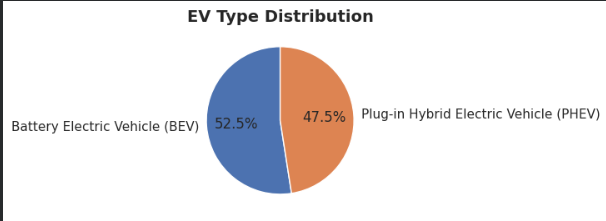
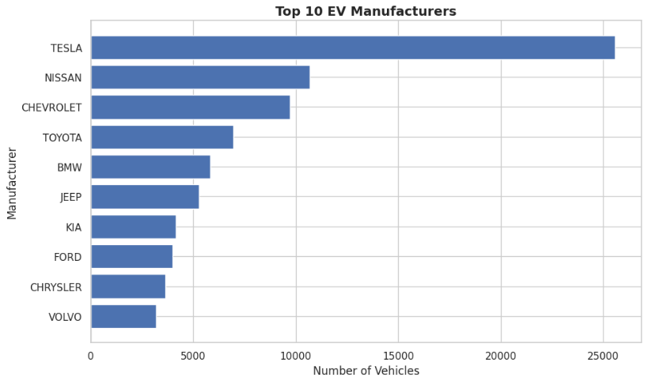
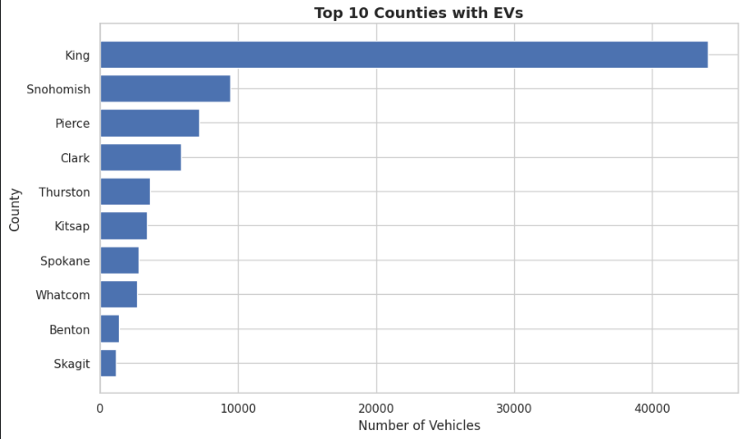
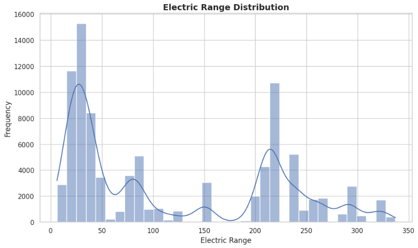
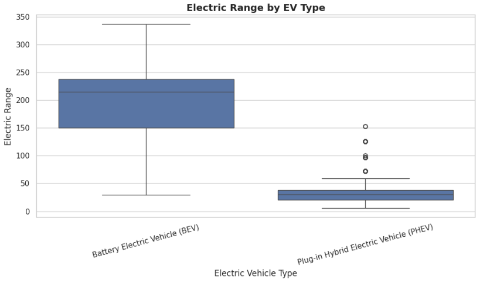
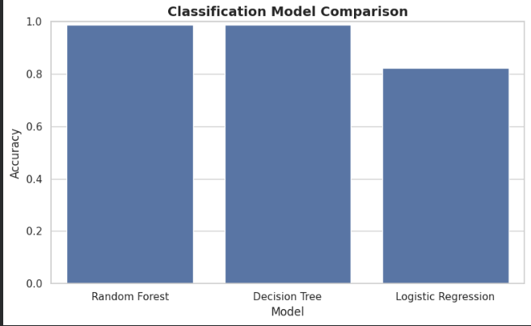
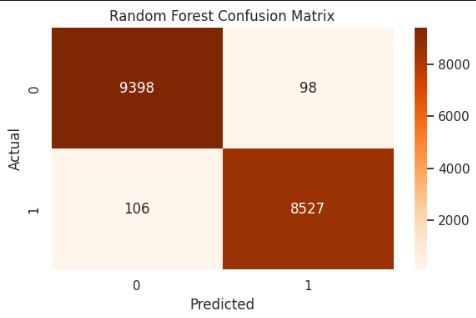
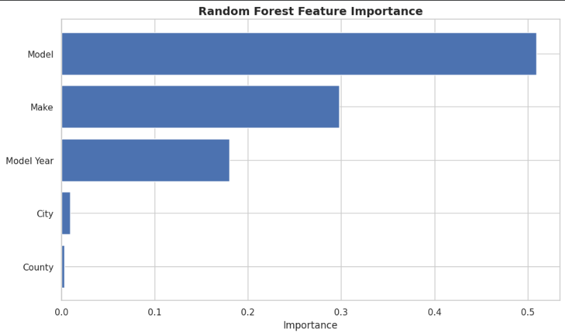

# 🚗 Electric Vehicle Adoption Analysis & Prediction

## 📌 Project Overview

This project analyzes electric vehicle adoption trends using Washington state EV registration data. It combines exploratory data analysis and machine learning to uncover adoption patterns, compare EV types, identify leading manufacturers and regions, and build predictive models for classification and range-related insights.

---

## 🎯 Objectives

* Analyze EV adoption trends over time
* Compare Battery Electric Vehicles (BEVs) and Plug-in Hybrid Electric Vehicles (PHEVs)
* Identify top manufacturers, counties, and EV models
* Explore electric range behavior across vehicle types
* Build machine learning models for EV-related prediction tasks

---

## 📊 Exploratory Data Analysis

### EV Adoption Trend Over Time

* EV registrations increased sharply in recent years
* Adoption accelerated significantly after 2018

### EV Type Distribution

* The dataset shows a near-balanced mix of BEVs and PHEVs
* BEVs slightly lead overall adoption

### Top EV Manufacturers

* Tesla dominates the market by a large margin
* Nissan and Chevrolet also show strong presence

### Top Counties with EVs

* EV adoption is concentrated in a few counties
* King County leads by a wide margin

### Electric Range Distribution

* Electric range varies widely across vehicles
* The distribution suggests multiple clusters of EV capability

### Electric Range by EV Type

* BEVs generally provide much higher electric range than PHEVs
* PHEVs tend to cluster at lower range values

---

## 🤖 Machine Learning Analysis

### Classification Model Comparison

* Compared Logistic Regression, Decision Tree, and Random Forest
* Tree-based models outperformed Logistic Regression
* Random Forest and Decision Tree delivered the strongest classification accuracy

### Best Model Confusion Matrix

* The best-performing model achieved strong classification results
* Predictions were highly accurate across both classes

### Feature Importance

* Model and Make were the most influential features
* Model Year also contributed meaningfully to predictions

---

## 🛠️ Tools & Technologies

* **Python** – Data analysis and machine learning
* **Pandas, NumPy** – Data cleaning and preprocessing
* **Matplotlib, Seaborn** – Data visualization
* **Scikit-learn** – Classification and regression modeling
* **Jupyter Notebook** – Project development and experimentation

---

## 📈 Key Insights

* EV adoption has grown rapidly in recent years
* BEVs slightly outnumber PHEVs in the dataset
* Tesla is the leading manufacturer by a wide margin
* EV adoption is concentrated in high-density counties
* BEVs offer significantly higher electric range than PHEVs
* Tree-based machine learning models performed best for classification tasks

---

## 🚀 How to Run

1. Open `ev-adoption-analysis-and-prediction.ipynb`
2. Install the required Python libraries
3. Run all notebook cells to reproduce the analysis and models

---

## 💡 Project Highlights

* Combined **EDA, visualization, and machine learning**
* Used a **real-world EV registration dataset**
* Compared multiple classification models
* Interpreted feature importance for better model understanding
* Focused on both **analytical insights and predictive modeling**

---

## 👤 Author

**Krishna Maniyar**
Data Analyst | AI & Machine Learning Enthusiast
