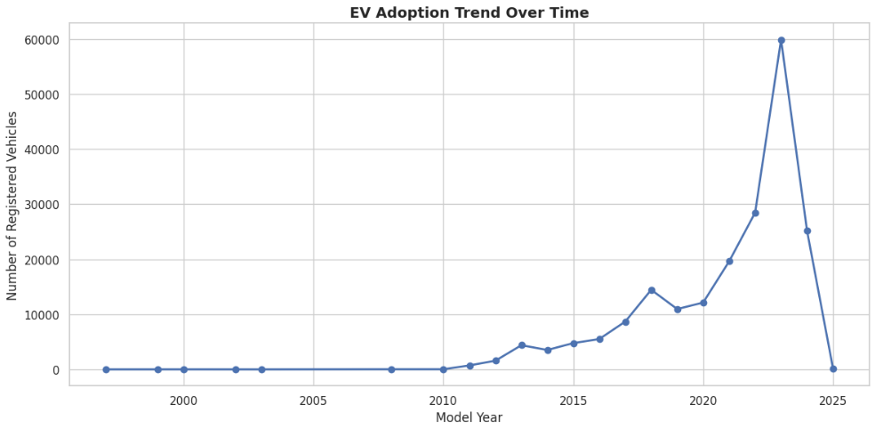
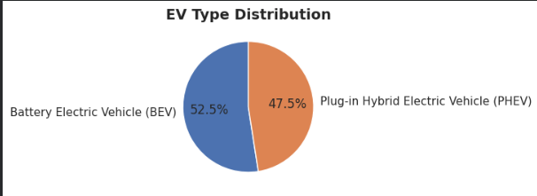
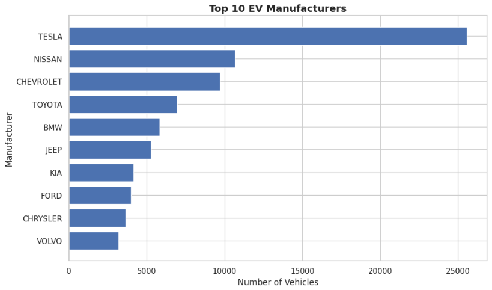
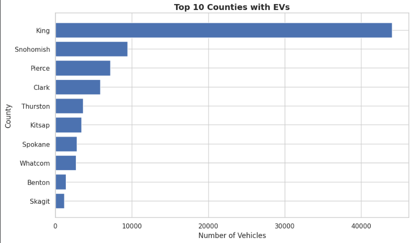
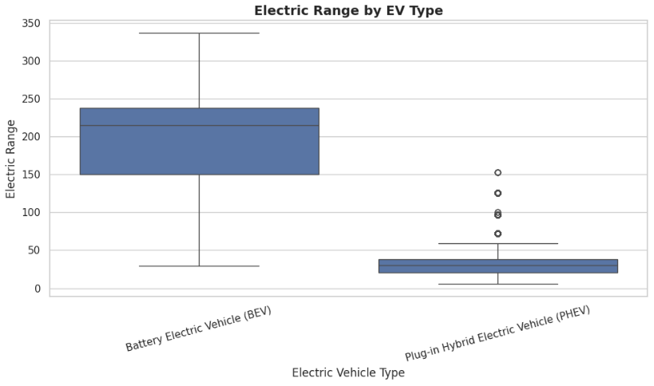
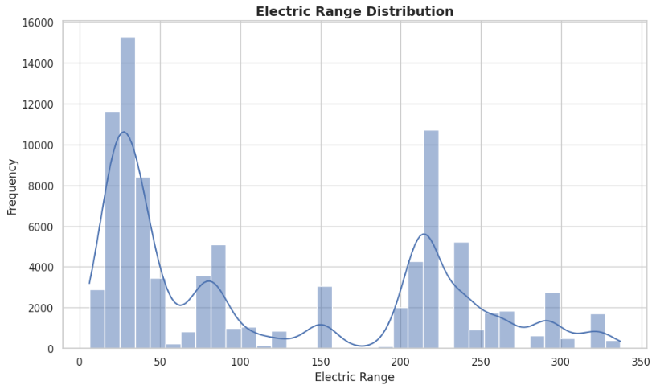
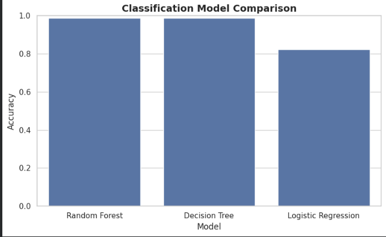
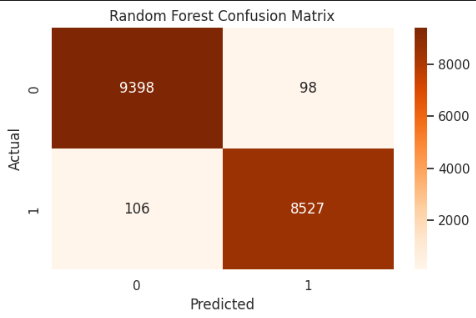
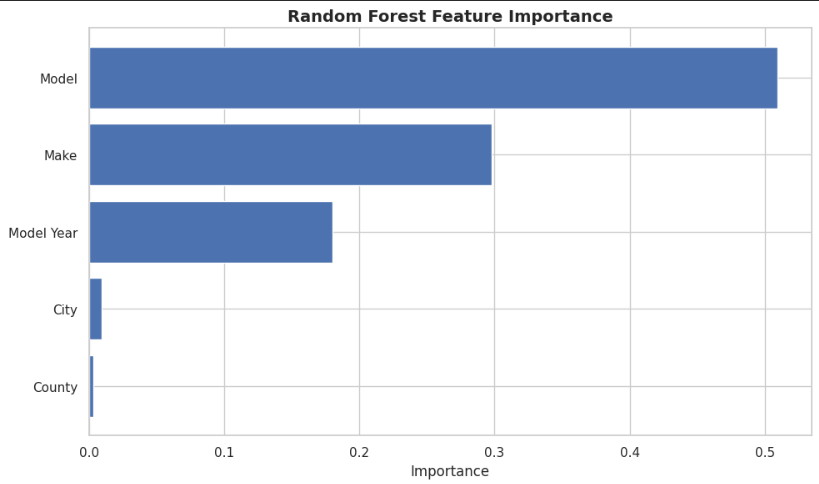

# 🚗 Electric Vehicle Adoption Analysis (Washington State)

Exploratory data analysis and predictive modeling on **200K+ Washington State
electric-vehicle registration records**, uncovering adoption trends, manufacturer
and geographic concentration, and BEV vs. PHEV range differences.

> **Data Source:** Washington State Department of Licensing, EV Population dataset
> (200,048 records, 17 columns). Real-world, publicly available registration data.



---

## 🎯 Objectives
- Analyze EV adoption trends over time
- Compare Battery Electric (BEV) vs. Plug-in Hybrid (PHEV) vehicles
- Identify leading manufacturers, models, and counties
- Examine electric-range behavior across vehicle types
- Build baseline models to predict EV type and electric range

---

## 🧹 Dataset & Preparation

| Stage | Records | Notes |
|---|---|---|
| Raw registration data | 200,048 | 17 columns as published by WA DOL |
| After cleaning | 200,044 | Dropped null geography rows, reduced to 11 analysis columns |
| **Range-valid subset** | **90,643** | Rows where `Electric Range > 0` |

Roughly 55% of records carry an electric range of `0`, flagged in the source data as
*"Eligibility unknown as battery range has not been researched."* These are placeholders
rather than true zero-range vehicles, so all range and modeling work runs on the
**90,643-record range-valid subset**. Descriptive counts covering the full population
use the cleaned 200,044-record set.

The range-valid subset spans **35 manufacturers, 98 models, and 155 counties**.

---

## 📊 Key Findings (EDA)

| Insight | Result |
|---|---|
| EV registrations | Grew sharply, accelerating after **2015** |
| BEV vs. PHEV split | **52.5% BEV / 47.5% PHEV** (range-valid subset) |
| Top manufacturer | **Tesla** (25,581), then Nissan (10,677), Chevrolet (9,706) |
| Geographic concentration | **King County = 48.6%** of all EVs |
| Avg. electric range | **BEV 197 mi vs. PHEV 31 mi** |
| Longest average range by make | **Tesla 241 mi**, Jaguar 234 mi, Polestar 233 mi |
| Dataset coverage | 35 makes · 98 models · 155 counties |







Range is strongly **bimodal**. PHEVs cluster tightly at a median of 30 miles (IQR 21 to 38),
while BEVs center on a median of 215 miles (IQR 150 to 238). The two interquartile ranges do
not overlap at all, though the extremes do: the shortest-range BEV is 29 miles and the
longest-range PHEV reaches 153. That separation is what makes the classification task below
far easier than it first appears.

---

## 🤖 Predictive Modeling

### Classification: Predicting EV Type (BEV vs. PHEV)

Features: `Make`, `Model`, `Model Year`, `City`, `County` (label-encoded).
Train/test split: 80/20 on the 90,643-record subset (18,129 test rows).

| Model | Accuracy |
|---|---|
| Logistic Regression | 82.3% |
| Decision Tree | 98.8% |
| **Random Forest** | **98.9%** |





> **Interpretation:** Tree-based models reach very high accuracy largely because
> **Make and Model nearly determine EV type** (Model = 51%, Make = 30% importance,
> 81% combined). This is a textbook case of strong feature-target dependence. A Tesla
> Model 3 is a BEV by definition and a Chrysler Pacifica Hybrid is a PHEV by definition,
> so the model is closer to reading a lookup table than learning a difficult boundary.
> The headline accuracy reflects that relationship, not model sophistication.

**A note on the logistic baseline.** The 82.3% figure is not a like-for-like comparison.
Categorical features here are label-encoded as ordinal integers, which tree models are
invariant to but logistic regression is not, since it reads arbitrary category codes as a
continuous scale. One-hot encoding would give a fairer baseline. The gap is reported
as-is for transparency rather than presented as evidence that trees are inherently
stronger on this problem.

### Regression: Predicting Electric Range (baseline)

A Linear Regression baseline using vehicle attributes explained only part of the
variation in electric range:

| Metric | Value |
|---|---|
| R² | **0.265** |
| MAE | **73.45 mi** |
| RMSE | 85.05 mi |

Categorical vehicle attributes alone are weak predictors of range. Battery capacity,
trim level, and model-year-specific specifications are absent from the source data and
are likely where the missing signal sits. This serves as a baseline for future feature
engineering rather than a usable predictor.

---

## ⚠️ Limitations & Next Steps

- **Feature-target leakage in the classification task.** Make and Model effectively encode
  the label. A more meaningful version would exclude them and predict EV type from
  geography, model year, and MSRP alone.
- **Label encoding penalizes the linear baseline.** Re-running Logistic Regression with
  one-hot encoded categories would make the model comparison fair.
- **Range placeholders.** The 55% of records with a `0` range are excluded rather than
  imputed. Any range statistic here describes the researched subset, not the full fleet.
- **No temporal validation.** Adoption is strongly time-trended; a time-based split would
  test generalization to newer model years more honestly than a random split.
- **Base MSRP is largely zero** in the source data and contributes almost nothing to the
  regression, so price effects remain untested.

---

## 🛠️ Tools & Technologies
`Python` · `Pandas` · `NumPy` · `Matplotlib` · `Seaborn` · `Scikit-learn` · `Jupyter Notebook`

---

## 📁 Repository Structure
```
├── ev-adoption-analysis-and-prediction.ipynb   # Full analysis: EDA, modeling, evaluation
├── images/                                     # Exported charts
│   ├── ev-adoption-trend.png
│   ├── ev-type-distribution.png
│   ├── top-ev-manufacturers.png
│   ├── top-counties-with-evs.png
│   ├── electric-range-by-ev-type.png
│   ├── electric-range-distribution.png
│   ├── classification-model-comparison.png
│   ├── random-forest-confusion-matrix.png
│   └── random-forest-feature-importance.png
└── README.md
```

---

## 🚀 How to Run
1. Open `ev-adoption-analysis-and-prediction.ipynb`
2. Install the required libraries (`pandas`, `numpy`, `matplotlib`, `seaborn`, `scikit-learn`)
3. Run all cells to reproduce the analysis and models

---

## 👤 Author
**Krishna Maniyar**, Data Analyst
📧 krishnamaniyarkm22@gmail.com · [LinkedIn](https://www.linkedin.com/in/krishnamaniyar/) · [Portfolio](https://krishnamaniyar2209.github.io/)
